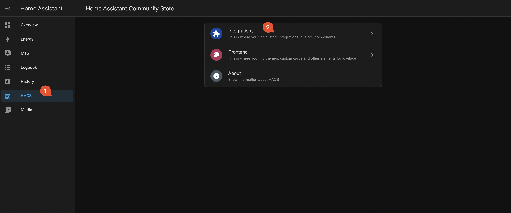
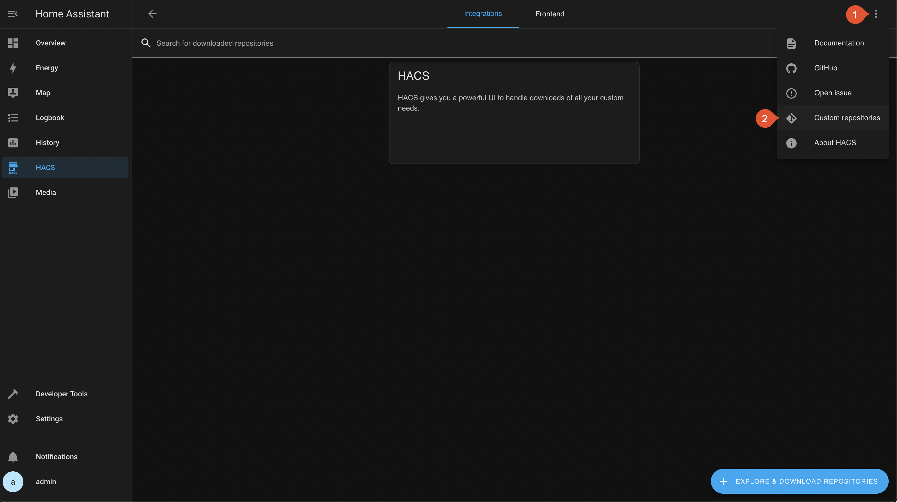
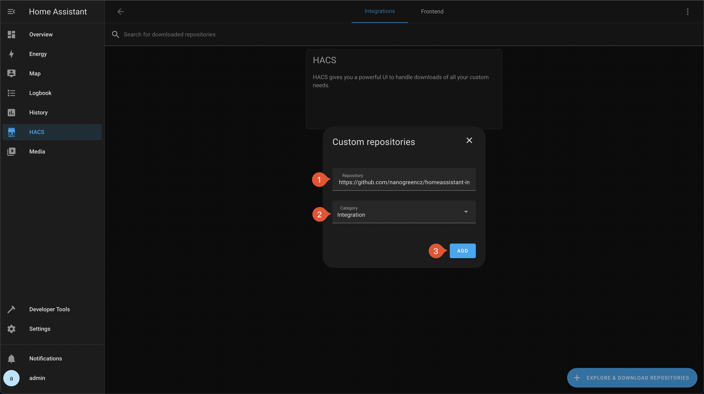
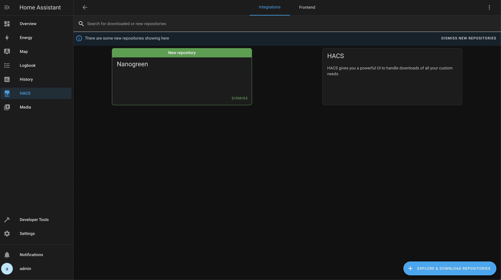
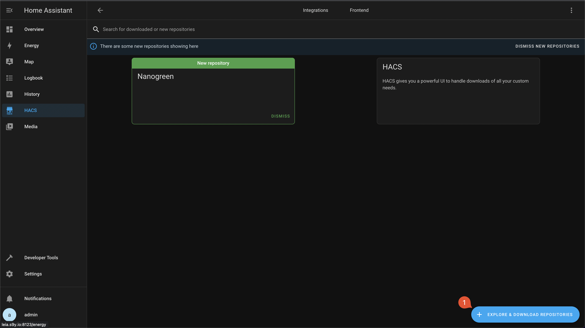
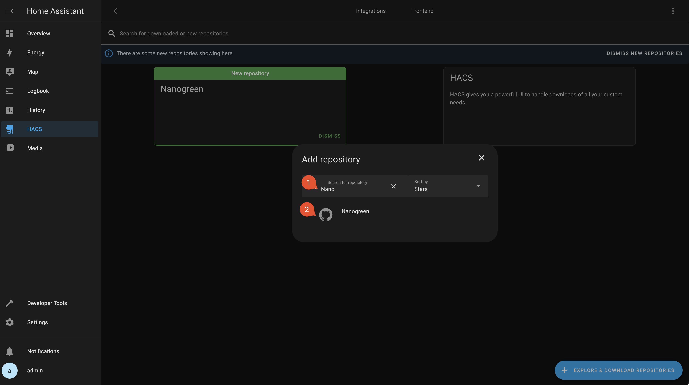
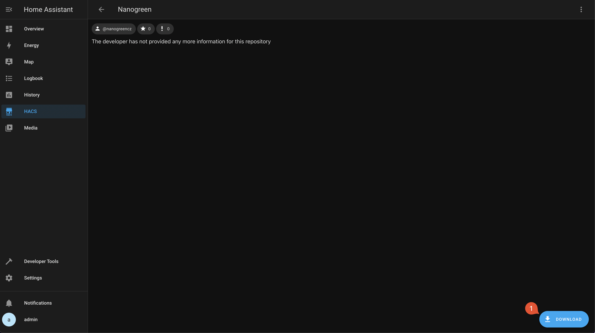
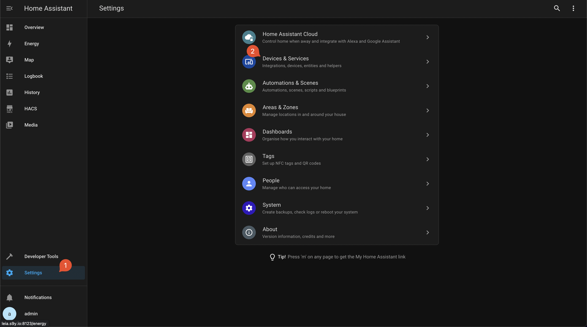
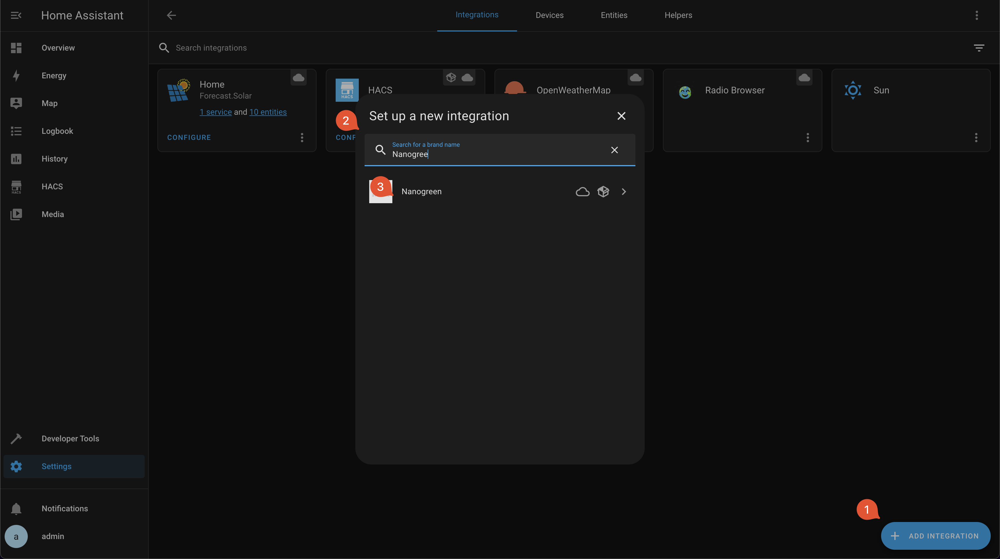
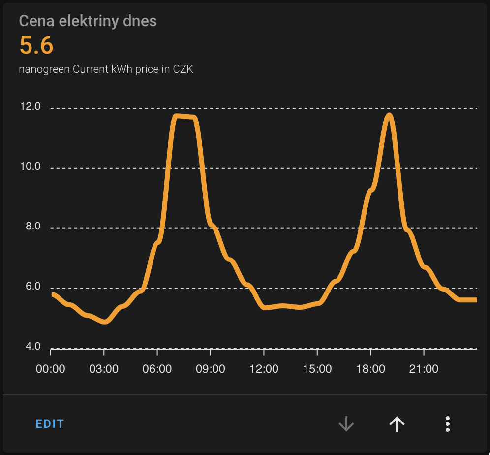

# Home Assistent Nanogreen Integrace

## Instalace

1. Nainstalujte HACS pomocí [oficiálního návodu](https://hacs.xyz/docs/setup/prerequisites).
2. Zrestartujte Home Assistenta.
3. Přidejte Nano Green repozitář.

Klikněte na "HACS" v levém menu.

Klikněte na "Integrations".



Klikněte na tři tečky v pravém horním rohu obrazovky.

Klikněte na "Custom repositories".



Do pole "Repository" přidat `https://github.com/nanogreencz/homeassistant-integrations`.

Ve výběru "Category" vybrat `Integration`.

Klikněte na "Add".



Repozitář by se vám měl zobrazit mezi ostatními repozitáři.



4. Stáhněte Nano Green integraci.







5. Zrestartujte Home Assistenta.

6. Nainstalujte Nano Green integraci pomocí Home Assistent settings menu.





## Sensory

| Jméno                                           | ID                                                     |
| ----------------------------------------------- | ------------------------------------------------------ |
| `Current kWh price in CZK`                      | `sensor.current_kwh_price_in_czk`                      |
| `Is currently cheapest electricity hour in day` | `sensor.is_currently_cheapest_electricity_hour_in_day` |
| `Base cheapest hour`                            | `sensor.base_cheapest_hour`                            |
| `Base second cheapest hour`                     | `sensor.base_second_cheapest_hour`                     |
| `Offpeak cheapest hour`                         | `sensor.offpeak_cheapest_hour`                         |
| `Offpeak second cheapest hour`                  | `sensor.offpeak_second_cheapest_hour`                  |
| `Peak cheapest hour`                            | `sensor.peak_cheapest_hour`                            |
| `Peak second cheapest hour`                     | `sensor.peak_second_cheapest_hour`                     |

Vysvětlení:

PEAK LOAD (8:00 - 20:00)

OFFPEAK LOAD (0:00 - 8:00, 20:00 - 24:00)

## Grafy

### Cena elektřiny



- Po nainstalování [ApexCharts](https://github.com/RomRider/apexcharts-card) přes HACS de návodu, přidejte custom komponentu a vložte do ní níže uvedený kód.

```yaml
type: custom:apexcharts-card
header:
  show: true
  title: Cena elektriny dnes
  show_states: true
  colorize_states: true
series:
  - entity: sensor.current_market_price_czk_kwh
    data_generator: |
      return entity.attributes.today_hourly_prices.map((price, index) => {
        const date = new Date().setHours(index)
        return [date, price];
      });
graph_span: 24h
span:
  start: day
```
